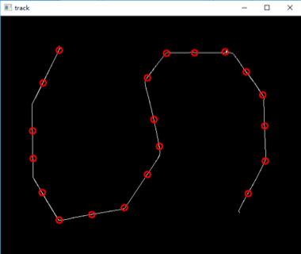
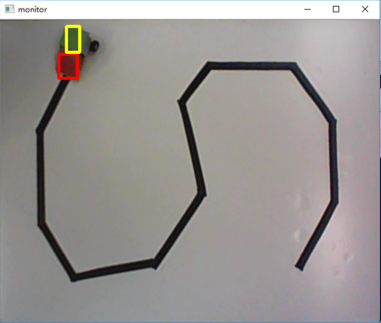
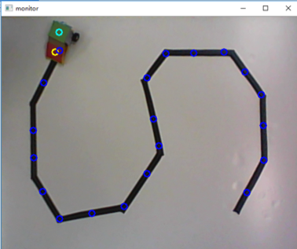
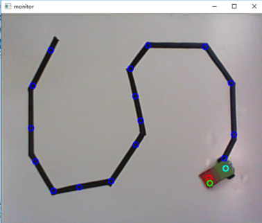

# SJTU-EI228: Control Car by OPENCV
## Description
Given a path made by black tape, we need to control a small car to go along the path on a white board by computer. In this repo, the code running on computer is provided, and the code for hardware is not provided. The computer can control the car through a camera and the process is semiautomatic.  

For more details **in Chinese**, please refer to [http://ice.sjtu.edu.cn/kc/2017-12/B34/](http://eelab.sjtu.edu.cn/kc/2017-12/B34/).

## Pipeline

### Adjust Camera

After opening the camera, we need to adjust the angle of the camera so that we can see the whole board on the screen.

### Perspective Transformation

Click the four vertices of the board and the program will do perspective transformation automatically.

### Image Binarization

You can use the trackbar to choose the threshold by yourself. Experimentally，it is proper to set the threshold from 50 to 60.

### Image Thinning & Corner Detection

Thin the path in the binary image to the width of one pixel. Then we use corner detection to represent the path.

### Car Recognition with Camshift

We paste a piece of red paper and a piece of green paper to the head and the tail of the car. It is trivial to recognize its head and tail by recognizing red and green paper in the frame through RGB value, and this method is very unstable when the environment changes. Therefore, we choose **Camshift** which is relatively stable.

You need to use mouse to draw bounding boxes for head and tail of the car. We use red and yellow rectangles to mark bounding boxes.

### Car Control and Serial Commmunication

We calculate the centers of the car's head and tail, then we can get its direction. Based on the corners we detected, we can determine whether the car should go forward or backward, turn left or turn right. After knowing how the car should move, the command controlling the car is sent to the car by serial communication.

Finally, the car reaches the destination.

 
