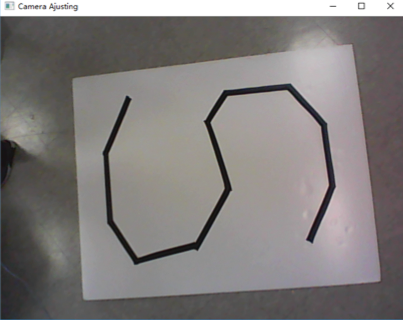
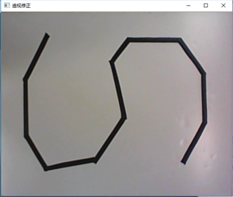
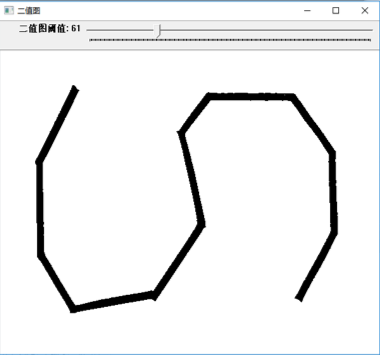

# SJTU-EI228: Control Car by OPENCV
## Description
Given a path made by black tape, we need to control a small car to go along the path on a white board by computer. In this repo, the code running on computer is provided, and the code for hardware is not provided. The computer can control the car through a camera and the process is semiautomatic.  

For more details **in Chinese**, please refer to [http://eelab.sjtu.edu.cn/kc/2017-12/B34/](http://eelab.sjtu.edu.cn/kc/2017-12/B34/).

## Pipeline

### Adjust Camera

After opening the camera, we need to adjust the angle of the camera so that we can see the whole board on the screen.

### Perspective Transformation

Click the four vertices of the board and the program will do perspective Transformation automatically.

### Image Binarization

You can use the trackbar to choose the threshold by yourself. Experimentally，it is proper to set the threshold from 50 to 60.

### Image Thinning

### Corner Detection

### Car Recognition with Camshift

### Car Control and Serial Commmunication

